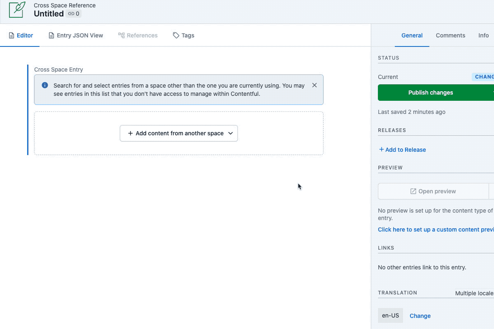
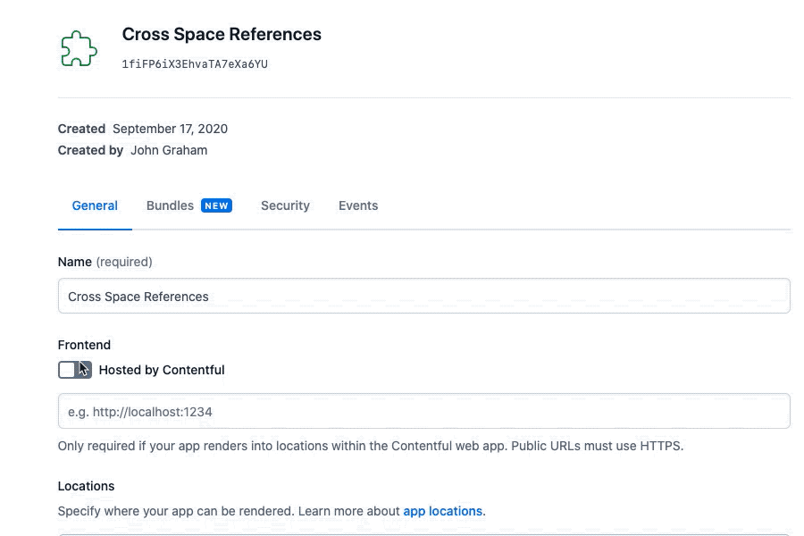
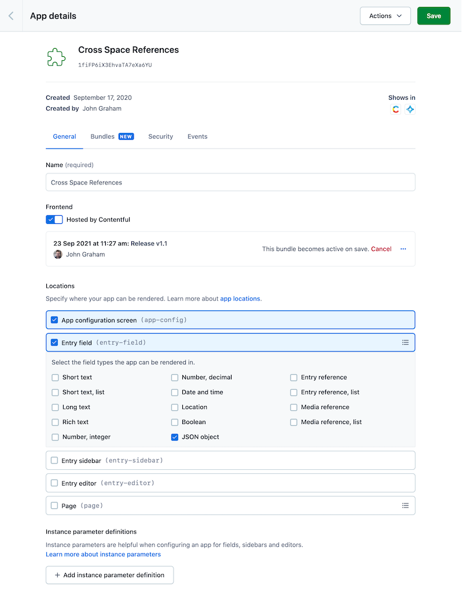
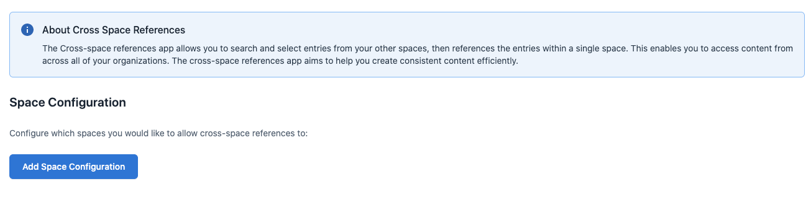
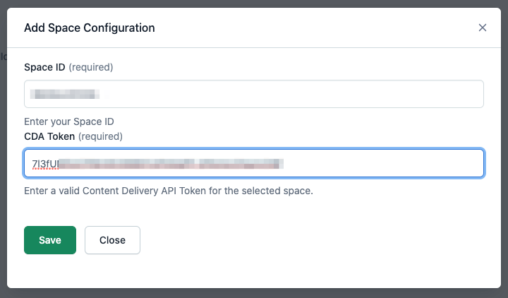
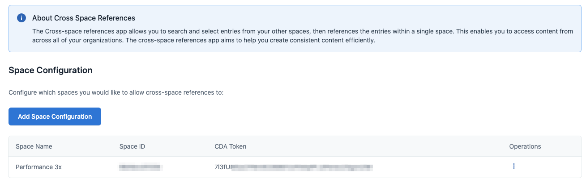
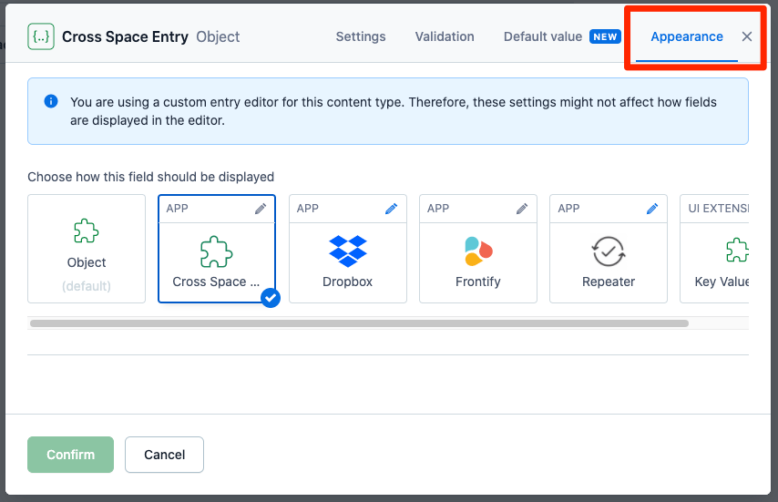

# Contentful Cross Space References

Contentful Cross Space References is a simple app that makes it easy to create a relationship between content in multiple Contentful spaces via the Contenful UI: 



---

## Installation

To use this app in your spaces, follow the below steps:

### Create the App Definition
1. Download the [latest release](https://github.com/jgrahamdev/contentful-cross-space-references/releases/latest) of the app bundle.
2. Extract the contents of the release.
3. Create a new app definition as described in [Building your first app](https://www.contentful.com/developers/docs/extensibility/app-framework/tutorial/#create-your-appdefinition).
4. Give your app a name (such as Cross Space References) and click the "Save" icon in the top right corner of the page. _Note: You must save your app before you can upload a bundle to take advantage of Contentful Hosting for this application._
5. Configure your app as seen here: 
   1. Select the option "Hosted by Contentful" checkbox underneath the "Frontend" heading to allow Contentful to host this app for you.
   2. Drag-and-drop the `Build` directory you extracted from the latest release to the UI window.
   3. Add a comment to the new modal window (such as the version information) and then select "Finish"
   1. Select the checkboxes for "App Configuration Screen" and "Entry Field", then select the checkbox for "JSON Object" below "Entry Field"
6. If done correctly, your App Definition should look like the following: 
7. Select "Save", then select "Save" in the confirmation modal that appears.

### Configure and Install the App to your Space
1. From the App Definition window, select the down arrow next to "Actions", then select "Install to space".
2. Select a Space and Environment where you'd like to install this app in the modal window that appears, then select "Continue".
3. Authorize the Cross Space References app for your space, after which you'll be redirected to the App Configuration screen, as seen here: 
4. This app will only be able to be installed after you've defined at least one external space from which you'd like to create relationships to this space's content, so select the "Add Space Configuration" button.
5. In the modal window, enter a Space ID and Content Delivery API token that will be used to retrieve Content from your external space as seen here: . _Note: you will be unable to save this configuration if the Space ID and Token are invalid._
6. Select Save in the modal window, at which point you'll see the external space listed in your App Configuration: 
7. Select "Install".
   1. _Note: Additional external spaces can be added after installation by returning to this screen via the App tab -> Manage Apps_
   2. _From the Apps management page, selecting the dropdown menu to the right of your Cross Space Configuration app and choose the Configure option._
   3. _Once back in the App Configuration Screen, you can add a new space configuration and select "Save" to update your new configurations._
   4. _You can also install this app in additional spaces from the App Managment tab of those spaces by selecting the Cross Space References app from the list of Available apps, then following steps 3-7 above.

### Configuring your Content Types
1. For every Content Type you'd like to be able to reference content from an external space, create a new "JSON Object" field, then set the appearance for this field to use the Cross Space Reference App: 

## JSON Field Output
When using the Cross Space References app, the reference will be stored as a JSON object with the following structure: 

```json
{
    "sys": {
        "type": "Link",
        "linkType": "CrossSpaceEntry",
        "id": "<entry-id>",
        "space": {
            "sys": {
                "type": "Link",
                "linkType": "Space",
                "id": "<space-id>"
            }
        }
    }
}
```

To retrieve the entry data, make an API call to the appropriate space and query by entry id as described in our documentation: [Getting a single entry](https://www.contentful.com/developers/docs/references/content-delivery-api/#/reference/entries/entry/get-a-single-entry/console/curl)

---

This project was bootstrapped with [Create Contentful App](https://github.com/contentful/create-contentful-app).

## Available Scripts

In the project directory, you can run:

#### `npm start`

Creates or update your app definition in contentful, and runs the app in development mode.
Open your app  to view it in the browser.

The page will reload if you make edits.
You will also see any lint errors in the console.

#### `npm run build`

Builds the app for production to the `build` folder.
It correctly bundles React in production mode and optimizes the build for the best performance.

The build is minified and the filenames include the hashes.
Your app is ready to be deployed!

## Learn More

[Read more](https://www.contentful.com/developers/docs/extensibility/app-framework/create-contentful-app/) and check out the video on how to use the CLI.

Create Contentful App uses [Create React App](https://create-react-app.dev/). You can learn more in the [Create React App documentation](https://facebook.github.io/create-react-app/docs/getting-started) and how to further customize your app.
